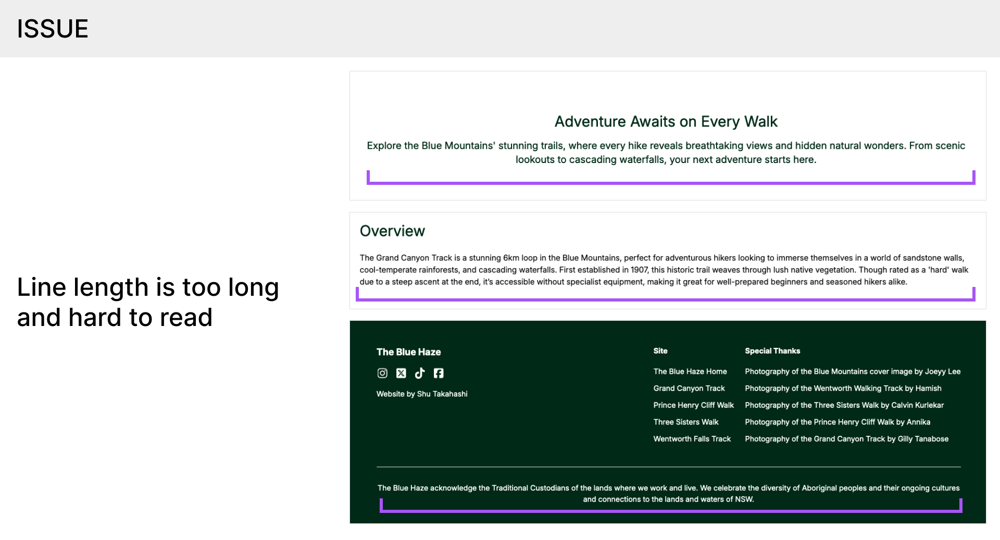
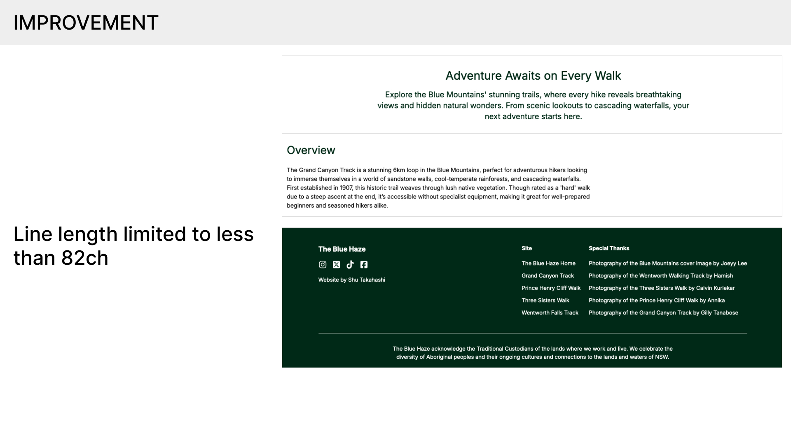
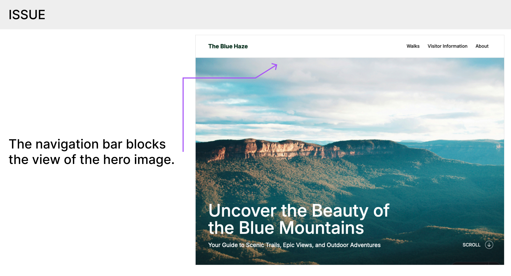
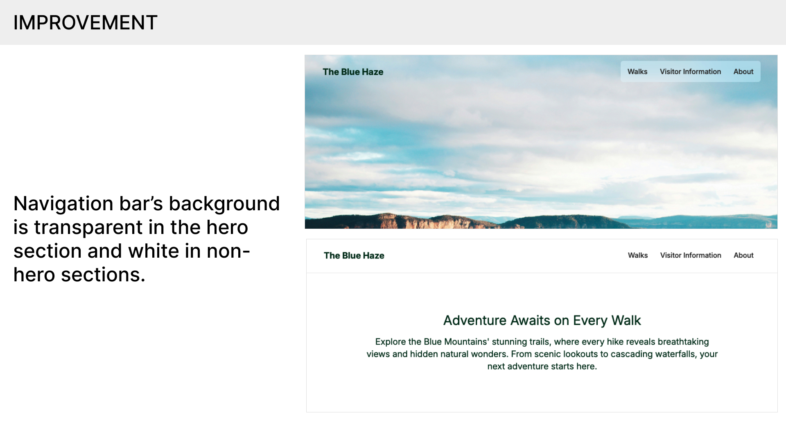
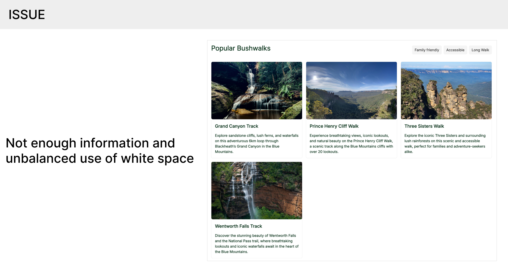
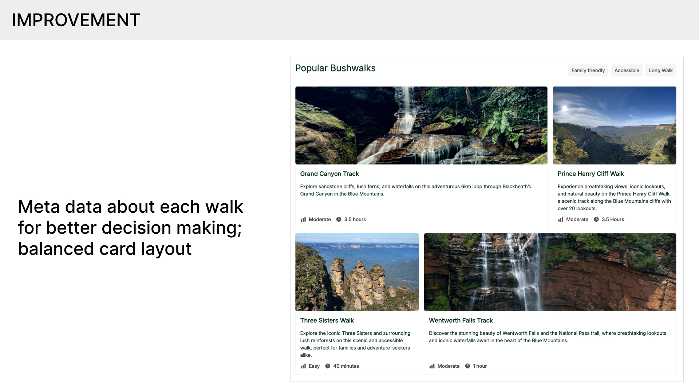
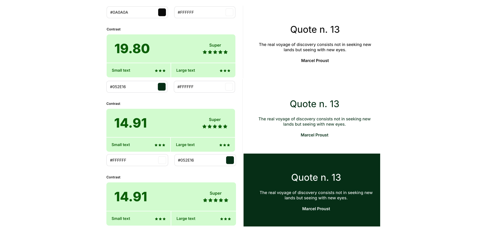
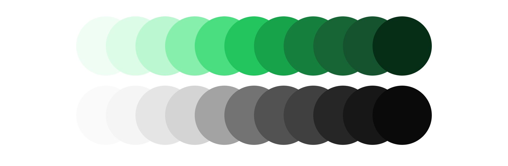

# Overview

The Blue Haze is a microsite designed for hikers looking to visit the Blue Mountains in NSW, Australia. The website is designed in response to the 2024 brief for DECO1016 at USYD. The website is hosted at https://project-eucalyptus.vercel.app/ and the GitHub repository is available at https://github.com/shutallbridge/project-eucalyptus.

Website Link: https://project-eucalyptus.vercel.app/

GitHub: https://github.com/shutallbridge/project-eucalyptus

# Getting Set Up

- Make sure to have Node JS of version 20 or above.
- At the root directory level (where `package.json` is available) run the following commands to build and preview the website:
  - `npm install` to install all node packages necessary for this project
  - `npm run build` to build the website (e.g. transpile Typescript, static-site generation with Astro, etc.)
  - `npm run preview` to preview the built website
  - Go to the local host page indicated on the CLI (usually http://localhost:4321/)
- `npm run dev` can also be used to

> For understanding the basics of Tailwind CSS, please refer to the comparison of classic CSS and Tailwind CSS in `src/components/FilterChip.astro`

> For a complete reference of Tailwind CSS, please refer to the [Tailwind CSS documentation](https://tailwindcss.com/docs)

> Installing the Tailwind CSS VSCode extension will enable the code editor to provide intellisense for Tailwind CSS classes and allow for the preview of css properties that would be applied.

# Information for Code Review

- Pages
  - `src/pages/index.astro` - Main entry point and the home page of the website
  - `src/pages/walks/[slug].astro` - Page for each of the walks featured on the website
- Styles
  - `/src/base.css` - Base styles with Tailwind directives and one-off or long css rules not managed by Tailwind.
- Content
  - `/src/content/walks/*.json` - JSON files that contain the content for each of the walks featured on the website
  - `/src/content/config.ts` - Defines the schema of the content mentioned above
- Components
  - `/src/components/*.astro` - Components used throughout the website such as the website shell, walk cards, and buttons.

# Implementation

The website is a Node JS project that uses Astro, Typescript, Tailwind CSS and Alpine JS. These libraries are lightweight libraries that provide good developer experience while making the final website performant.

- Astro - Is a static site generator that exports to static HTML, CSS and JavaScript while enabling crucial features to good development such as enabling JSX-like expressions (e.g. `walks.map()` enumerate the list of walks in the content directory rather than having repetitive hard coded HTML) and components (e.g. making components such as `<InfoCard/>`).
- Typescript and Zod - The website uses JSON files to manage and provide the website content (this would come from an external CMS in production). The shape of this data is defined by a content schema inside `content/config.ts` and this validates the content data while providing type completion support in typescript supported code editors (e.g. VSCode). These features make the codebase type-safe and keeps the website easily maintainable.
- TailwindCSS - A CSS utility class library provides a way to compose utility classes while centralizing and tokenizing important styling properties like font sizes, color schemes and border radius. Tailwind CSS together with Astro component abstractions enable me to separate my concern by components rather than at different language levels (i.e. HTML, CSS, JavaScript are decoupled from each other which is not ideal)

# Notable Iterations Made

## Iterating on the Line Length

- I received feedback from a friend that the long texts in the overview section, sub-hero section, and the country acknowledgement, had too much line length–he had difficult time reading these texts on desktop devices as his eyes could not easily follow the texts.
- I used the `max-width` property to limit the width of `
` in `px` . This worked but the line width was inconsistent with different font sizes (e.g. in different sections with different font sizes or changing the user-agent preferred font size)
- I remembered the unit `ch` also existed which is a more relative unit. Setting `
` to `65ch` for example would text within approximately 65 characters per line no matter the font size.
- In the end, I used the `max-width` property using the `ch` unit to fix the readability issue of long texts.

## Iterating on the Navigation Bar

- The navigation bar sometimes felt too bulky and took up too much space. At times, my eyes went to the navigation bar more than the content.
- This was especially the case for the hero section where I want to have all users focus on the hero title and sub-title together with the full-screen hero image.
- To fix this, I made the navigation bar’s background transparent. The hero section now felt more immersive, but the the transparent background made the navigation harder to use on non-hero sections.
- I researched ways to have the navigation bar switch between a transparent background and a white background. There were two main options:
  - Use the `scroll()` CSS function with the `animation-timeline` property to correlate the background opacity to the user’s scroll position.
  - Use the `IntersectionObserver` API to detect when the hero section is not within the user’s viewport.
- The `scroll()` CSS function was only supported in the newer versions of Chrome and Edge, and had no support on Firefox and Safari. The `IntersectionObserver` on the other hand, had a much better compatibility on all major browsers. Therefore, I decided to use the latter.
- The `IntersectionObserver` now triggers the CSS to switch between a white background and a transparent background. I also added a transition for the background color to have this switch feel more smooth.

## Iterating on the Card Content and Layout

- I also received a feedback from a friend that the walk cards only had a title and a description. This was not enough information to make a decision quickly as to which walk to check out.
- This was especially the case when he used the filter buttons to filter for walks such as long walks. The information given in this section didn’t add up coherently.
- In addition, I also noticed that with the four walk cards displayed in the three column desktop layout, there was too much white space on the second row which threw off the visual balance.
- To improve the lack of clarity from each card, I added meta data from each walk such as the duration and difficulty. This made it easier for me to decide which walk I want to check out.
- In implementing this, I was able to reuse the code I wrote for the walk specifications in individual walk pages. I abstracted this part of the code into a component called `MetaChip`
- To improve the white space issue, I modified the CSS so that when there are four cards in the section, the first and the fourth cards span two columns instead of one. This made a more balanced use of white space and made each card stand out better.

# Accessibility

## Using Semantic HTML

The website adheres to best practices for using semantic HTML tags and improving accessibility for users relying on screen readers:

- The navigation follows the most accessible structure: `<nav/> -> <ul/> -> <li/>` (omitting `
` tags in-between for styling purposes).
- The hero section on the main page or the cover image section in each individual walk page are wrapped in `<header/>` to indicate the introductory content.
- The main content such as walk descriptions, timeline and visitor information are all in `<main/>` each wrapped in `<section/>` to indicate distinct content sections.
- Similarly the footer of the website is wrapped in a `<footer/>` tag to indicate the end of the website content.
- Links and buttons use `<a/>` and `<button/>` tags respectively to make sure screen reader users also are made aware of the possible interactions.

## Contrast

The website uses a combination of text colors and background colors that have a high contrast ratio of over 14:1 to ensure the content is readable, usable, and comfortable for everyone. This is especially crucial for users with visual impairments and color blindness.

## ALT Text Attribute

All content images have a descriptive `alt` attribute that accurately describes the image. This is crucial for users that are using screen readers to use the website. The `alt` text is a mandatory field for all content on the website.

## Font Size

All font sizes are based on the `rem` which ensures that all text content are relative to the user’s preferred font size (this is usually 16px). This is important for users that have a different preferred browser font size such as users that have a hard time reading small texts. In addition, all spacing units are also based on the base font size with either `rem` or `ch`, and this ensures that the layout of the website also respects the preferred font size.

# Aesthetics

## Color Scheme

I chose to use dark green as my primary color scheme. This color is known to convey a sense of [nature and tranquility](https://thrive.design/color-psychology-web-design/)–moods suitable for the website (Britton, 2023). The library authors of Tailwind CSS offer a [wide range of curated color schemes](https://tailwindcss.com/docs/customizing-colors) by hue in different shades (TailwindCSS, n.d.). The colors vary in shades from 50 to 950 each of same hue, but of different saturation and lightness. The website uses the palette “green”.

To support the primary color, the “neutral” gray color palette is used throughout the design, as seen in background elements, navigation links, and icons. These gray tones provide a clean backdrop that doesn’t compete with the rich greens of the primary color. They also help maintain readability.

## Font Choice

The website uses Inter–a sans-serif typeface–that gives it a clean, approachable, and contemporary look. This choice complements the [modern design approach](https://cliowebsites.com/the-role-of-typography-in-web-design/) and is important to keep the focus on readability and ease of navigation (Misic, n.d.).

## Layout

The website’s layout is designed to prioritize clarity and intuitive navigation, and ensures that visitors are able to access the information they need. The layout also leverages ample white space to avoid visual clutter and keep the focus on the important content like trail descriptions, maps and visitor information.

## Language

Although not directly related to the aesthetics, the tone of the website content also reflects on the mood and personality of the website. In general, the content on this website is written to have tones that are both informative and inviting. This is important as the website aims to both welcome visitors to the park and inform its users with the information they need to visit the Blue Mountains. Important information, such as trail difficulty and accessibility, is communicated in straightforward language, as these kinds of information need to prioritize clarity.

# Works Cited

Misic, N. (n.d.). _The role of typography in web design: An in-depth guide_. From Clio Websites: https://cliowebsites.com/the-role-of-typography-in-web-design/

TailwindCSS. (n.d.). _Customizing colors_. From TailwindCSS: https://tailwindcss.com/docs/customizing-colors

Britton, N. (2023, November 6). _The psychology of color in web design and how to use it_. From Thrive: https://thrive.design/color-psychology-web-design/
